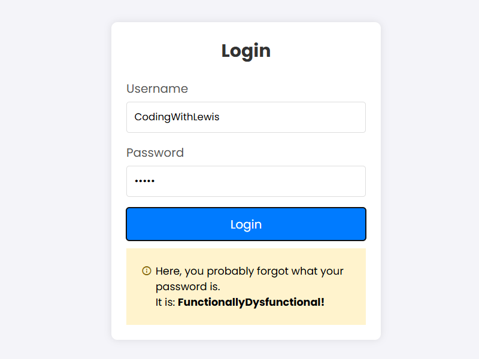
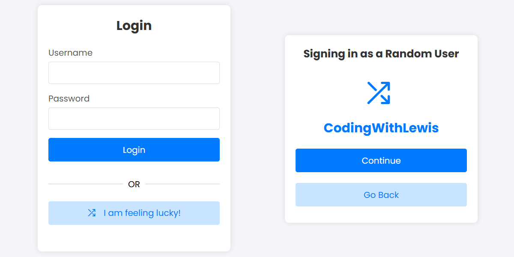
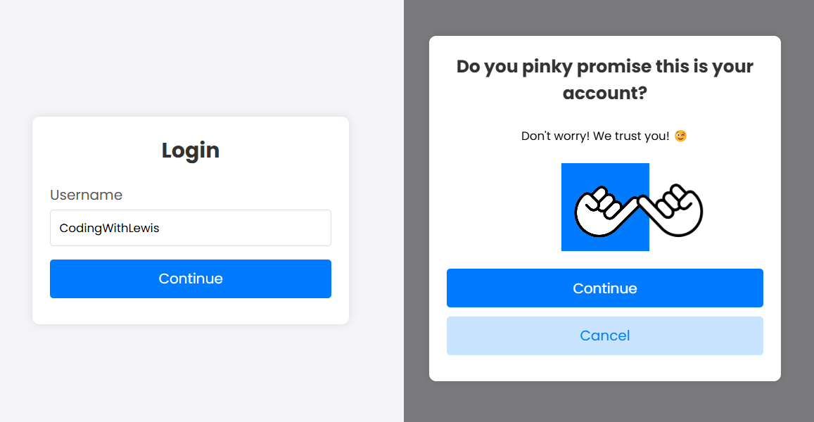

# Functionally Dysfunctional - Unconventional Login Methods

Welcome to **Functionally Dysfunctional**, a hackathon project showcasing three unconventional and quirky login methods that are both functional and fun! This project is part of the "Functionally Dysfunctional" Hackathon hosted by Lewis Menelaws.

## 🚀 Features

- **Method 1:** _A login method that helps you in case you forget your password._ 😉
- **Method 2:** _Can't remeber your credentials? Just log in as a random user!_ 😂
- **Method 3:** _Authentication? Hell nah! We trust you!_ 😇

## 🖼️ Screenshots

  
*Login Method 1*

  
*Login Method 2*

  
*Login Method 3*

## 🛠️ Usage

This project contains simple web applications. No installations or special setup are required.

### Steps to Use:

1. Download or clone this repository.
    ```bash
    git clone https://github.com/tech-savvy-guy/functionally-dysfunctional.git
    cd functionally-dysfunctional
    ```

2. Open any of the `index.html` files in your preferred web browser.

## 📄 License

This project is licensed under the MIT License - see the [LICENSE](LICENSE) file for details.

---

*This project was created for the "Functionally Dysfunctional" Hackathon by Soham Datta.*
